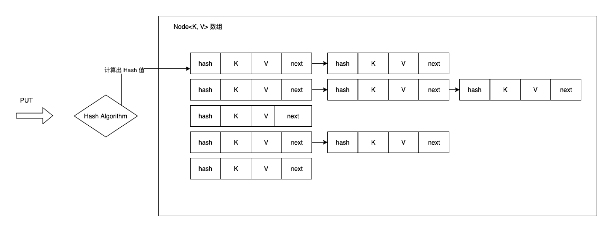

# 重读 Java HashMap 源码

class java.util.HashMap<K, V>

HashMap 类维护了一个 Node<K, V>类型的数组 Node<K, V>[] table, 
用来维护 Key。Node 是 HashMap 的内部静态类，并实现了 Map.Entry 接口。
在第一次使用的时候初始化，并在必要的时候扩容，数组的长度永远是 2 的倍数。

```
/**
  * The table, initialized on first use, and resized as
  * necessary. When allocated, length is always a power of two.
  * (We also tolerate length zero in some operations to allow
  * bootstrapping mechanics that are currently not needed.)
  */
transient Node<K,V>[] table;
```

主要的字段如果下所示，内部维护了下一个元素的指针 next，方便实现链表或树结构。
```
static class Node<K,V> implements Map.Entry<K,V> {
    final int hash;
    final K key;
    V value;
    Node<K,V> next;
}
```

## PUT 方法
```
  public V put(K key, V value) {
      return putVal(hash(key), key, value, false, true);
  }
```

## putVal 方法

```
/**
  * Implements Map.put and related methods.
  *
  * @param hash hash for key
  * @param key the key
  * @param value the value to put
  * @param onlyIfAbsent if true, don't change existing value
  * @param evict if false, the table is in creation mode.
  * @return previous value, or null if none
  */
final V putVal(int hash, K key, V value, boolean onlyIfAbsent, boolean evict) {
    Node<K,V>[] tab; Node<K,V> p; int n, i;

    // 如果 table 为空，则初始化 table，并将 table 的长度赋值给 n
    if ((tab = table) == null || (n = tab.length) == 0)
        n = (tab = resize()).length;
      
    // 将 (n - 1) & hash 的值赋值给 i, 并将 tab[i] 的元素赋值给 p
    // 如果 p 为空，说明该位置没有元素，则直接新建一个 Node 放在此处。
    if ((p = tab[i = (n - 1) & hash]) == null)
        tab[i] = newNode(hash, key, value, null);

    // 如果位置 i 已有元素
    else {
        Node<K,V> e; K k;

        // 如果 p 的 hash 等于新 hash 且 p 的 key 等于新 key
        // 说明 p 和要插入的新元素的 key 是重复的，需要用新元素的 V 覆盖就元素的 V 就行了。
        // 这里只是将 p 赋值给 e，在方法最后会用到这旧元素
        // 注意，这里的 p 只是当前数组位置的链表头节点，或树的跟节点
        if (p.hash == hash &&
            ((k = p.key) == key || (key != null && key.equals(k))))
            e = p;
        
        // 这里是针对 LinkedHashMap 的处理，
        else if (p instanceof TreeNode)
            e = ((TreeNode<K,V>)p).putTreeVal(this, tab, hash, key, value);
        
        // 如果新元素不和首位元素的 key 一致，那么就需要追加到链表的尾部，或树的叶子位置
        else {
            for (int binCount = 0; ; ++binCount) {
                // 在此处追加
                // 注意：e 是一个指针，不断的指向下一个节点
                if ((e = p.next) == null) {
                    p.next = newNode(hash, key, value, null);
                   
                    // 如果链表的长度超出了预设的阀值，则将链表转换程 树
                    if (binCount >= TREEIFY_THRESHOLD - 1) // -1 for 1st
                        treeifyBin(tab, hash);
                    break;
                }

                // 如果在半路已经找到了重复的 key，则跳出循环，目标的元素指针已经更新到变量 e 了。
                if (e.hash == hash &&
                    ((k = e.key) == key || (key != null && key.equals(k))))
                    break;

                // 更新 p 的指针，指向下一个
                p = e;
            }
        }

        // 如果发现了旧元素，则按照需要替换旧元素的的 V 即可
        if (e != null) { // existing mapping for key
            V oldValue = e.value;
            if (!onlyIfAbsent || oldValue == null)
                e.value = value;
            afterNodeAccess(e);
            return oldValue;
        }
    }

    // 经过上面的处理，已经将新元素插入到合适的位置了
    // 接下就是一些收尾工作

    // 计数，此 map 的修改次数，主要用于并发
    ++modCount;

    // 扩容数组长度，如果需要
    if (++size > threshold)
        resize();
    afterNodeInsertion(evict);
    return null;
}
```

## 图示

